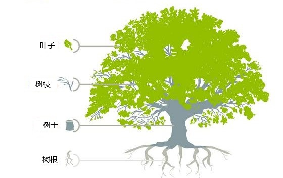
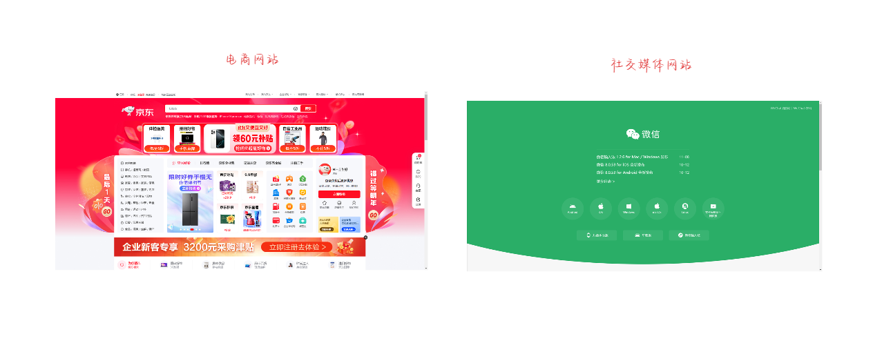

# 第二章：软件行业中的各种职业方向

## 2.1 概述

* 在计算机软件的发展过程中，涌现出了各种各样的职业，如：前端工程师、后端工程师、架构师、算法工程师、大数据工程师、运维工程师、嵌入式工程师、底层开发（操作系统、数据库、浏览器、游戏引擎）等。
* 我们知道，在自然界中，树是由`叶子`、`树枝`、`树干`和`树根`组成的，如下所示：

> [!NOTE]
>
> * ① `前端工程师`相当于树的`叶子`部分。
> * ② `后端工程师`相当于树的`树枝`部分。
> * ③ `架构师`相当于树的`树干`部分。
> * ④ `底层开发`相当于树的`树根`部分。

## 2.2 前端工程师

### 2.2.1 B/S 架构中的前端工程师

* 在 B/S 架构应用中，前端主要关注于浏览器端（B 端）显示的页面和可交互的界面，也可以称为 `“WEB 前端”`。
* 常见的 WEB 前端应用有：电商网站、社交媒体网站、企业门户，如下所示：

* WEB 前端涉及到的技术有：`HTML`、`CSS` 和 `JavaScript`（很重要）。

> [!NOTE]
>
> ::: details 点我查看 WEB 前端发展的历史
>
> * ① HTML 是用来做网页的`内容结构`，CSS 是用来做网页的`视觉体验`，而 JavaScript 是用来做网页的`交互处理`。
> * ② 在互联网的早期，网页应用往往前后端不分离，典型的编程语言有 PHP 和 Java（JSP），它们都采取将前端 HTML/JavaScrpit 等代码直接集成到后端代码中的方式来进行开发。这样做的好处是开发效率高，但缺点是可维护性差，适合用于快速开发简单的应用。
> * ③ 随着应用的需求越来越复杂，尤其是移动互联网的崛起，推动了应用的前后端分离，可跨平台的 JavaScript 框架崛起，常用框架和库：React.js、Angular.js、Vue.js 等。
> * ④ ...
>
> :::

* 应用程序越上层，越接近用户，则变动和灵活性越大。

> [!NOTE]
>
> * ① 一方面，直接呈现给用户的部分，会随着审美的变化经常变动。
>* ② 另一方面，应用的更新总是最先体现在前端应用中；换言之，前端知识更新频繁！！！

> [!CAUTION]
>
> 前端开发入门简单，门槛较低，且深度和复杂性确实不及后端开发，相关就业岗位有萎缩的趋势！！！

### 2.2.2 C/S 架构中的前端工程师

* 在 C/S 架构应用中，前端主要关注于客户端应用本身，也可以称为`“客户端开发”`。

> [!NOTE]
>
> ::: details 点我查看 客户端开发的分类
>
> * ① 桌面客户端开发：
>   * QT（C++ 跨平台框架）。
>   * Swift（用于开发 Apple 各种应用的编程语言）。
> * ② 移动客户端开发：
>   * 安卓端：Java（传统的安卓开发语言）、Kotlin（现代的、Google 推荐的 Android 开发语言）。
>   * iOS 端：Swift。
>   * 可跨平台的：React Native、Uniapp 等。
>
> :::

## 2.3 后端工程师

### 2.3.1 概述

* 对于 B/S 架构应用或 C/S 架构应用，后端主要关注于`业务逻辑`和`软件架构`。

### 2.3.2 业务逻辑

* 其中，`业务逻辑`是指系统为了满足特定业务需求所需的操作、流程和规则。这是应用中处理实际业务流程的核心内容，如：对数据的增删改查、计算、数据验证和流程控制等。

> [!NOTE]
>
> `业务逻辑`的主要内容有：
>
> * ① **数据处理**：包括数据的验证、计算、转换以及持久化（存储到数据库）。
> * ② **规则校验**：用户输入的格式和范围校验、权限验证等。
> * ③ **工作流和决策逻辑**：根据特定条件决定流程的下一步操作。
> * ④ **接口调用和集成**：与外部系统或服务进行交互，以获取或提交数据。

> [!NOTE]
>
> ::: details 点我查看 B/S 架构和 C/S 架构中`业务逻辑`的区别
>
> * ① **B/S 架构**：业务逻辑通常完全放在服务器端，浏览器通过 HTTP 请求向服务器发送数据和指令，后端完成所有处理并返回结果。这种模式更易于集中管理和更新，但对服务器的负载压力较大。
> * ② **C/S 架构**：业务逻辑可以部分在客户端实现，部分在服务器实现。客户端可能会负责一些简单的数据处理和校验逻辑，而复杂的处理仍由服务器端完成。这样做可以减轻服务器的压力，但会增加客户端的复杂性。
>
> :::

### 2.3.3 软件架构

* 其中，`软件架构`是指系统的整体设计，描述了系统各个模块如何协同工作。良好的架构可以提高系统的扩展性、可维护性和稳定性。

> [!NOTE]
>
> 常见的`架构模式`：
>
> * ① **MVC（Model-View-Controller）**：将系统分为模型、视图和控制器三部分，常见于 B/S 架构。
> * ② **三层架构（Presentation-Business-Data）**：将系统分为表示层、业务逻辑层和数据层，使得不同层次的功能更清晰，便于管理和扩展。
> * ③ **微服务架构**：将系统划分为多个小型服务，每个服务负责不同的业务功能，适合复杂的大型系统。

> [!NOTE]
>
> :::details 点我查看 B/S 架构和 C/S 架构中`架构模式`的区别
>
> * ① **B/S 架构**：由于前端较轻，主要依赖后端处理和响应，因此常采用 MVC 架构，微服务架构也越来越普遍，用于分离不同的业务功能，提高灵活性和扩展性。
> * ② **C/S 架构**：客户端通常较为“厚”，因此前后端界限较清晰，业务逻辑和 UI 呈现在客户端，服务器主要提供数据和必要的业务支持。C/S 系统常用三层架构和 SOA（面向服务的架构）来提供较高的系统灵活性。
>
> :::

### 2.3.4 综合应用

* 在 B/S 和 C/S 架构中，业务逻辑和软件架构相辅相成。

> [!NOTE]
>
> 设计合理的业务逻辑流程和健壮的架构可以使系统更好地应对不同的业务场景和需求变化：
>
> * **可维护性**：业务逻辑清晰、架构合理，可以降低维护难度，如：在 B/S 架构中，通过服务端更新业务逻辑，所有客户端立即生效。
> * **性能优化**：通过架构优化（负载均衡、缓存策略等），能提升系统在高并发场景下的响应速度。
> * **扩展性**：通过微服务或分布式架构设计，系统可以根据业务发展灵活扩展新的服务或功能模块。

* 在实际应用中，B/S 架构和 C/S 架构的后端设计虽然在部署方式和交互流程上有所差异，但都依赖于合理的业务逻辑和软件架构来满足用户需求和系统要求。

> [!NOTE]
>
> * ① 通常而言，`后端工程师`主要关注于`业务逻辑`，而`架构师`主要关注于`软件架构`。
> * ② 但是，有些`后端工程师`也会关注`软件架构`。

### 2.3.5 后端工程师的其他工作

* 对数据库中的数据进行增删改查操作，处理前端请求，完成与前端的交互，这是后端最常处理的业务逻辑，也是后端程序员最主要的任务之一。
* 但是，后端工程师还负责与其他服务或组件交互（第三方 API 、缓存、消息队列、短信服务等）、身份验证和授权、数据加工计算、安全控制、监控日志、提供 API 、数据备份与恢复等一系列的工作。

> [!NOTE]
>
> 上述的这些东西都是可以沉淀的，并且变化不是很大！！！
>
> * ① 前端由于硬件限制、用户界面的限制、浏览器的限制等等问题通用性是比较差的。
> * ② 后端应用则一般具有很高的通用性：不同的前端应用，无论是手机还是电脑，无论是网页还是桌面应用，都可以共用同一套后端逻辑。这是因为后端主要关注的是业务逻辑和数据处理，而不是用户界面和交互方式。

* 诸如：手机登录 QQ 、微信和电脑登录 QQ、微信，虽然界面、功能、操作逻辑等前端部分大不相同，但仍然都是同一个账号，数据是一样的。
* 诸如：多端互通的游戏，虽然各平台的前端展示可能不同，但所有的游戏数据和逻辑处理都是统一的。

> [!NOTE]
>
> * ① 这种架构的通用性使得后端可以灵活地应对不同平台和设备，从而大大提高了开发效率和系统的可维护性。
> * ② 后端的语言、架构等通常变化比较少，后端程序员也往往有更多的方向、内容去进行提高和沉淀。后端的潜力，往往是比前端大的。
> * ③ 当然后端的技术栈也会更复杂，涉及复杂的后端架构(分布式、微服务架构)，各色中间件，多种解决方案等等。

### 2.3.6 后端领域中目前主流的语言

* ① Java：应用广泛，成熟稳定，是最常用的后端开发语言。尤其是在涉及电商的领域中，高并发场景多、业务变动快、稳定性要求高，延迟性要求低的场合中，Java 是绝对的王者。
* ② Python：以其简洁的语法和数据处理及分析上的能力而受欢迎（人工智能的首选语言）。
* ③ C#：微软的亲儿子，与 Windows 平台有很好的集成和交互（目前，也支持跨平台）。
* ④ Node.js：前后端同时使用 JavaScript 一种语言进行全栈开发。
* ⑤ Golang：一般简称 Go 语言。特别适用于高并发、大流量的场景，作为后起之秀是 Java 的有力竞争者。

## 2.4 底层开发/系统开发

* 底层应用/系统开发主要指的是进行一些系统层面，接近硬件层面的应用开发，如：
  * 数据库。
  * 操作系统。
  * 浏览器。
  * 游戏引擎。
  * 编译器。
  * 硬件驱动
  * ...

> [!NOTE]
>
> 在这些领域，C/C++ 是王者。

* 要想从事这些开发岗位，门槛是非常高的，学习难度很大，需要熟知操作系统原理，以及一些其它软硬件知识。

## 2.5 算法工程师

* 算法岗位在当今的技术领域中是非常重要且需求广泛的，几乎各行各业都需要专业的算法工程师来专注于开发和实现高效的算法来解决复杂的问题。
* 算法工程师在以下领域发挥着核心作用：
  * 大数据
  * 人工智能(人脸识别)
  * 机器学习
  * 云计算
  * ...

* 由于算法岗位的专业性和重要性，算法工程师的薪资普遍很高，而且前景广阔（太卷）。

> [!NOTE]
>
> * ① 算法岗位不以编程语言为核心，而以数学原理为核心，但一般也会要求至少掌握一门编程语言，如：Python(几乎必须掌握)、Java、C++(可以选择)。
> * ② 算法岗位的门槛比较高，需要扎实的数学功底，还需要进行算法体系和代码能力的积累，建议具有良好的相关学历背景的同学从事算法岗位，不推荐野路子半路出家走算法路线。
> * ③ C++ 在算法领域最常见的用途就是图像算法，如：人脸识别，著名的 OpenCV 就是用 C++ 编写的开源视觉库。

## 2.6 嵌入式工程师

* 嵌入式领域是一个专注于开发专用电子系统（嵌入式系统）的技术领域。
* 目前比较热门的嵌入式领域有：
  * ① 物联网（iot）：
    * 典型的智能家居（小米、华为等）。
    * 远程医疗器械、手环、智能穿戴设备。
    * 自动化养殖业、农业。
    * 智慧城市，交管系统、环境监测等。
    * ....
  * ② 汽车领域，车机系统，汽车上的各种电子系统，辅助驾驶，电子刹车系统等等。
  * ③ 工业自动化、机械自动化等等。
  * ④ ...

> [!NOTE]
>
> * ① 嵌入式开发的主导语言就是 C 语言。
> * ② 在进行嵌入式开发的过程中，仅仅会 C 语言是不够的，还需要涉及硬件交互，了解不少硬件、电子、外设协议等知识。