# MySQL | 事务


---

## 事务概述

1. `事务`是一个`最小的工作单元`。在数据库当中，`事务表示一件完整的事儿`。

2. 一个业务的`完成可能需要多条DML语句共同配合才能完成`，例如转账业务，需要执行两条DML语句，先更新张三账户的余额，再更新李四账户的余额，为了保证转账业务不出现问题，就必须保证要么`同时成功`，要么`同时失败`，怎么保证同时成功或者同时失败呢？就需要使用事务机制。

3. 也就是说用了事务机制之后，在同一个事务当中，多条DML语句会`同时成功，或者同时失败`，`不会出现一部分成功，一部分失败的现象`。

4. 事务只针对DML语句有效：因为只有这`三个语句`是改变表中数据的。
   1. **`insert`**
   2. **`delete`**
   3. **`update`**


## 事务四大特性：ACID

1. `原子性（Atomicity）`：是指事务包含的`所有操作`要么`全部成功`，要么`同时失败`。

2. `一致性（Consistency）`：是指`事务开始前`，和`事务完成后`，`数据应该是一致的`。例如`张三和李四的钱加起来是5000`，中间不管`进行过多少次的转账操作(update)`，`总量5000是不会变的`。这就是事务的一致性。

3. `隔离性（Isolation）`：隔离性是当多个⽤户并发访问数据库时，⽐如操作同⼀张表时，数据库为`每⼀个⽤户开启的事务`，`不能被其他事务的操作所⼲扰`，多个并发事务之间要相互隔离。

4. `持久性（Durability）`：持久性是`指⼀个事务⼀旦被提交了`，那么对数据库中的数据的`改变就是永久性的`，即便是在数据库系统`遇到故障的情况下也不会丢失提交事务的操作`。


## 演示MySQL事务
1. 在dos命令窗口中开启MySQL事务：start transaction; 或者：begin;

2. 回滚事务：rollback; 

3. 提交事务：commit;

4. 只要执行以上的rollback或者commit，事务都会结束。

**示例：**
```sql [SQL]
# 未提交事务(commit)-回滚事务(rollback)

mysql> start transaction;
Query OK, 0 rows affected (0.00 sec)

mysql> select * from t_user;
+----+------+
| id | name |
+----+------+
|  1 | jack |
+----+------+
1 row in set (0.00 sec)

mysql> insert into t_user(id,name) values(2,'lisi');
Query OK, 1 row affected (0.01 sec)

mysql> insert into t_user(id,name) values(3,'wangwu');
Query OK, 1 row affected (0.00 sec)

mysql> select * from t_user;
+----+--------+
| id | name   |
+----+--------+
|  1 | jack   |
|  2 | lisi   |
|  3 | wangwu |
+----+--------+
3 rows in set (0.00 sec)

mysql> rollback;
Query OK, 0 rows affected (0.01 sec)

mysql> select * from t_user;
+----+------+
| id | name |
+----+------+
|  1 | jack |
+----+------+
1 row in set (0.00 sec)

# 提交事务(commit)-回滚事务(rollback)

mysql> start transaction;
Query OK, 0 rows affected (0.00 sec)

mysql> insert into t_user(id,name) values(2,'lisi');
Query OK, 1 row affected (0.01 sec)

mysql> insert into t_user(id,name) values(3,'wangwu');
Query OK, 1 row affected (0.00 sec)

mysql> commit;
Query OK, 0 rows affected (0.01 sec)

mysql> select * from t_user;
+----+--------+
| id | name   |
+----+--------+
|  1 | jack   |
|  2 | lisi   |
|  3 | wangwu |
+----+--------+
3 rows in set (0.00 sec)

mysql> rollback;
Query OK, 0 rows affected (0.00 sec)

mysql> rollback;
Query OK, 0 rows affected (0.00 sec)

mysql> rollback;
Query OK, 0 rows affected (0.00 sec)

mysql> select * from t_user;
+----+--------+
| id | name   |
+----+--------+
|  1 | jack   |
|  2 | lisi   |
|  3 | wangwu |
+----+--------+
3 rows in set (0.00 sec)
```

> **`MySQL默认情况下`采用的`事务机制`是：`自动提交`。所谓自动提交就是`只要执行一条DML语句则提交一次`。**

```sql [SQL]
mysql> insert into t_user(id,name) values(1,'jack');
Query OK, 1 row affected (0.01 sec)

mysql> select * from t_user;
+----+------+
| id | name |
+----+------+
|  1 | jack |
+----+------+
1 row in set (0.00 sec)

mysql> rollback;
Query OK, 0 rows affected (0.01 sec)

mysql> select * from t_user;
+----+------+
| id | name |
+----+------+
|  1 | jack |
+----+------+
1 row in set (0.00 sec)
```


## 事务隔离级别


**隔离级别`从低到高`排序：`读未提交 < 读提交 < 可重复读 < 串行化`**
**不同隔离级别会存在不同的现象，现象按照严重性`从高到低`排序：`脏读 > 不可重复读 > 幻读`**

::: tip 提示
**注意：**
1. **`mysql默认的隔离`级别是：`可重复读`。**
2. **`oracle默认的隔离`级别是：`读提交`。**
:::


### 查看与设置隔离级别
mysql默认的隔离级别：可重复读（REPEATABLE READ）。

- 查看当前会话的隔离级别：select @@transaction_isolation;
- 查看全局的隔离级别：select @@global.transaction_isolation;

设置事务隔离级别：

- 会话级：set session transaction isolation level read committed;
- 全局级：set global transaction isolation level read committed;

### 不同现象

#### 脏读

指的是`一个事务`读取了另一个事务`尚未提交的数据`，即`读取了另一个事务`中的`脏数据（Dirty Data）`。在此情况下，如果另一个事务回滚了或者修改了这些数据，那么读取这些脏数据的事务所处理的数据就是不准确的。

#### 不可重复读

指在`一个事务内`，`多次读取同一个数据行`，得到的`结果可能是不一样的`。这是由于其他事务对数据行做出了`修改操作`，`导致数据的不一致性`。

#### 幻读

指在事务执行过程中，`前后两次相同的查询`条件得到的`结果集不一致`，`可能会变多或变少`。


### 隔离级别

#### 读未提交（READ UNCOMMITTED）
A事务与B事务，A事务可以读取到B事务未提交的数据。这是最低的隔离级别。几乎两个事务之间没有隔离。这种隔离级别是一种理论层面的，在实际的数据库产品中，没有从这个级别起步的。
当事务隔离级别是读未提交时，三种现象都存在：脏读，不可重复读，幻读。
我们可以开启两个DOS命令窗口，模拟两个事务，演示一下这种隔离级别。三种现象中最严重的是脏读，我们只需要演示脏读问题即可，因为存在脏读的话，就一定存在不可重复读和幻读问题。

将全局事务隔离级别设置为：READ UNCOMMITTED
```sql [SQL]
set global transaction isolation level read uncommitted;
```
```sql [SQL]
mysql> set global transaction isolation level read uncommitted;
Query OK, 0 rows affected (0.00 sec)

mysql> select @@global.transaction_isolation;
+--------------------------------+
| @@global.transaction_isolation |
+--------------------------------+
| READ-UNCOMMITTED               |
+--------------------------------+
1 row in set (0.01 sec)
```

开启两个DOS命令窗口来模拟两个事务：A事务与B事务。

| **A事务** | **B事务** |
| --- | --- |
| mysql> use powernode |   |
|   | mysql> use powernode |
| mysql> start transaction; |   |
|   | mysql> start transaction; |
| mysql> select * from a;
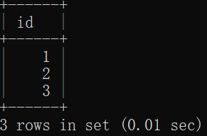 |   |
|   | mysql> insert into a values(4); |
| mysql> select * from a;
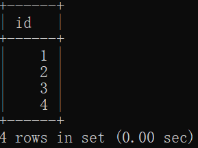 |   |


通过以上测试，可以看到，A事务读取到了B事务还没有提交的数据。这种现象就是脏读。

#### 读提交（READ COMMITTED）
A事务与B事务，A事务可以读取到B事务提交之后的数据。Oracle数据库默认的就是这种隔离级别。

将数据库的全局事务隔离级别设置为读提交：READ COMMITTED
```sql [SQL]
set global transaction isolation level read committed;
```

演示：

| **A事务** | **B事务** |
| --- | --- |
| mysql> use powernode |  |
|  | mysql> use powernode |
| mysql> start transaction; |  |
|  | mysql> start transaction; |
| mysql> select * from a;
 |  |
|  | mysql> insert into a values(4); |
| mysql> select * from a;
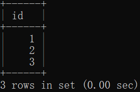 |  |
|  | mysql> commit; |
| mysql> select * from a;
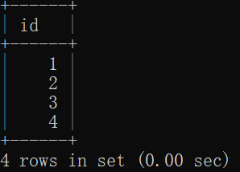 |  |

通过以上测试看出，A事务只能读取到B事务提交之后的数据。这种隔离级别解决了脏读问题，但肯定是存在不可重复读和幻读问题。因为只要事务B进行了增删改操作之后并提交了，事务A读取到的数据肯定是不同的。即：不可重复读和幻读都存在。

#### 可重复读（REPEATABLE READ）
这个隔离级别是MySQL数据库默认的。
A事务和B事务，A事务开启后，读取了某一条记录，然后B事务对这条记录进行修改并提交，A事务读取到的还是修改前的数据。这种隔离级别称为可重复读。

将数据库全局隔离级别修改为可重复读：
```sql [SQL]
set global transaction isolation level repeatable read;
```

演示：

| **A事务** | **B事务** |
| --- | --- |
| mysql> use powernode |  |
|  | mysql> use powernode |
| mysql> start transaction; |  |
|  | mysql> start transaction; |
| mysql> select empno,ename,sal from emp where empno=7369;
 |  |
|  | mysql> update emp set ename='SMITH',sal=8000 where empno=7369; |
|  | mysql> commit; |
| mysql> select empno,ename,sal from emp where empno=7369;
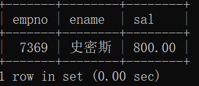 |  |

通过以上测试得知：当事务隔离级别设置为可重复读时，避免了不可重复读问题。

那么在MySQL当中，当事务隔离级别设置为可重复读时，能够避免幻读问题吗？测试一下：

| **事务A** | **事务B** |
| --- | --- |
| mysql> use powernode |  |
|  | mysql> use powernode |
| mysql> start transaction; |  |
|  | mysql> start transaction; |
| mysql> select * from a;
 |  |
|  | mysql> insert into a values(5); |
|  | mysql> commit; |
| mysql> select * from a;
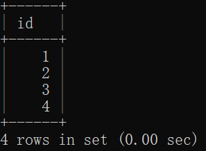 |  |

通过以上测试得知：**当事务隔离级别设置为可重复读时，也避免了幻读问题。是完全避免了幻读问题吗？并不是。**请看以下测试：

| **事务A** | **事务B** |
| --- | --- |
| mysql> use powernode |  |
|  | mysql> use powernode |
| mysql> start transaction; |  |
|  | mysql> start transaction; |
| mysql> select * from a;
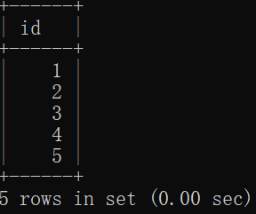 |  |
|  | mysql> insert into a values(6); |
|  | mysql> commit; |
| mysql> select * from a **for update;**
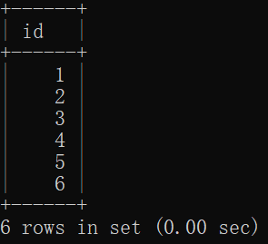 |  |

通过以上测试得知：**当事务隔离级别设置为可重复读，MySQL会尽最大努力避免幻读问题，但这种隔离级别无法完全避免幻读问题。**

#### 串行化（SERIALIZABLE）
这种隔离级别最高，避免了所有的问题，缺点是效率低，因为这种隔离级别会导致事务排队处理，不支持并发。

设置数据库全局隔离级别为串行化：
```sql [SQL]
set global transaction isolation level serializable;
```

演示：

| **事务A** | **事务B** |
| --- | --- |
| mysql> use powernode |   |
|   | mysql> use powernode |
| mysql> start transaction; |   |
|   | mysql> start transaction; |
| mysql> select * from a;
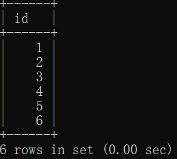 |   |
| mysql> insert into a values(7); |   |
|   | mysql> select * from a;
 |
| mysql> commit; |   |
|   | 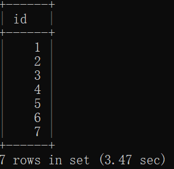 |

通过以上测试得知：当事务隔离级别设置为串行化时，事务只能排队执行，不支持并发。


### 可重复读的幻读问题
在上面讲解过程中我提到，MySQL默认的隔离级别可重复读，在很大程度上避免了幻读问题（并不能完全解决），那么它是如何解决幻读问题的呢，解决方案包括两种：

- 针对**快照读**（普通 select 语句），是**通过 MVCC 方式解决了幻读**，因为可重复读隔离级别下，事务执行过程中看到的数据，一直跟这个事务启动时看到的数据是一致的，即使中途有其他事务插入了一条数据，是查询不出来这条数据的，所以就很好的避免了幻读问题。
- 针对**当前读**（select ... for update 等语句），是**通过 next-key lock（记录锁+间隙锁）方式解决了幻读**，因为当执行 select ... for update 语句的时候，会加上 next-key lock，如果有其他事务在 next-key lock 锁范围内插入了一条记录，那么这个插入语句就会被阻塞，无法成功插入，所以就很好的避免了幻读问题。

#### 快照读是如何解决幻读的
什么是快照读？普通的select语句都是采用的快照读。顾名思义：在整个事务的处理过程中，执行相同的一个select语句时，每次都是读取的快照。（快照指的是固定的某个时刻的数据，就像现实世界中的拍照一样，把那个美好的时刻留下来）。也就是说，当事务隔离级别是可重复读，并且执行的select语句是一个普通的select语句时，都会采用快照读的方式读取数据，底层实现原理是：

- 底层由 MVCC（多版本并发控制）实现，实现的方式是开始事务后，在执行第一个查询语句后，会创建一个 Read View，后续的查询语句利用这个 Read View，通过这个 Read View 就可以在 undo log 版本链找到事务开始时的数据，所以事务过程中每次查询的数据都是一样的，即使中途有其他事务插入了新纪录，是查询不出来这条数据的，所以就很好的避免了幻读问题。

演示：

| **事务A** | **事务B** |
| --- | --- |
| mysql> use powernode |  |
|  | mysql> use powernode |
| mysql> start transaction; |  |
|  | mysql> start transaction; |
| mysql> select * from a; //快照读
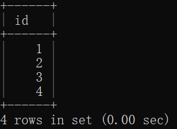 |  |
|  | mysql> insert into a values(5); |
|  | mysql> commit; |
| mysql> select * from a; //快照读
 |  |

#### 当前读是如何解决幻读的
当前读，顾名思义：每一次都读取最新的数据。当前读包括：update、delete、insert、select...for update。这个很好理解，因为增删改的时候都要基于最新的数据进行增删改。
而select...for update原理是：对查询范围内的数据进行加锁，不允许其它事务对这个范围内的数据进行增删改。也就是说这个select语句范围内的数据是不允许并发的，只能排队执行，从而避免幻读问题。
select...for update加的锁叫做：next-key lock。我们可以称其为：间隙锁 + 记录锁。间隙锁用来保证在锁定的范围内不允许insert操作。记录锁用来保证在锁定的范围内不允许delete和update操作。

假如有这样的数据：
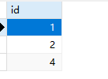
SQL语句是这样写的：
```sql [SQL]
select * from a where id between 2 and 4 for update;
```
那么id在[2-4]区间的所有记录行被锁定，不能插入3是通过间隙锁来搞定的。不能修改或删除2和4是通过记录锁来搞定的。

演示：

| **事务A** | **事务B** |
| --- | --- |
| mysql> use powernode |  |
|  | mysql> use powernode |
| mysql> start transaction; |  |
|  | mysql> start transaction; |
| mysql> select * from a where id between 2 and 4 for update; // 当前读 |  |
|  |  |

#### 出现幻读的两种情况
在同一个事务处理过程中，如果前后两次都采用快照读，或者都采用当前读，则不会出现幻读问题。如果第一次使用快照读，后面使用了当前读，则会出现幻读问题。


##### 第一种产生幻读的场景
A事务与B事务。在A事务中第一次查询使用快照读，B事务插入数据。然后在A事务中第二次查询使用当前读。则会产生幻读现象。
演示：

| **事务A** | **事务B** |
| --- | --- |
| mysql> use powernode |  |
|  | mysql> use powernode |
| mysql> start transaction; |  |
|  | mysql> start transaction; |
| mysql> select * from a;
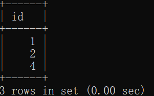 |  |
|  | mysql> insert into a values(5); |
|  | mysql> commit; |
| mysql> select * from a for update; // 产生了幻读
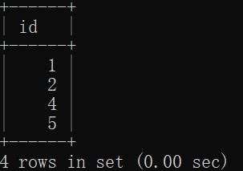 |  |

##### 第二种产生幻读的场景
事务A与事务B，在事务A中第一次查询使用快照读，在事务B中插入一条数据，然后在事务A中更新事务B插入的那条记录，最后在事务A中再次使用快照读。则会发生幻读现象。

| **事务A** | **事务B** |
| --- | --- |
| mysql> use powernode |  |
|  | mysql> use powernode |
| mysql> start transaction; |  |
|  | mysql> start transaction; |
| mysql> select * from a;
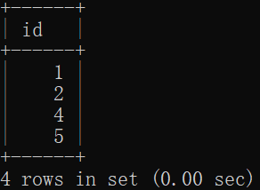 |  |
|  | mysql> insert into a values(6); |
|  | mysql> commit; |
| mysql> update a set id=100 where id=6; //主要是因为这个SQL语句的执行触发了当前读 |  |
| mysql> select * from a; // 产生了幻读
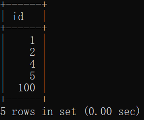 |  |

#### 总结可重复读的幻读问题
MySQL的可重复读隔离级别（默认隔离级），根据不同的查询方式，分别提出了避免幻读的方案：

- 针对快照读（普通 select 语句），是通过 MVCC 方式解决了幻读。
- 针对当前读（select ... for update 等语句），是通过 next-key lock（记录锁+间隙锁）方式解决了幻读。

我举例了两个发生幻读场景的例子。

- 第一个例子：对于快照读， MVCC 并不能完全避免幻读现象。因为当事务 A 更新了一条事务 B 插入的记录，那么事务 A 前后两次查询的记录条目就不一样了，所以就发生幻读。
- 第二个例子：对于当前读，如果事务开启后，并没有执行当前读，而是先快照读，然后这期间如果其他事务插入了一条记录，那么事务后续使用当前读进行查询的时候，就会发现两次查询的记录条目就不一样了，所以就发生幻读。

所以，MySQL 可重复读隔离级别并没有彻底解决幻读，只是很大程度上避免了幻读现象的发生。
要避免这类特殊场景下发生幻读的现象的话，就是尽量在开启事务之后，马上执行 select ... for update 这类当前读的语句，因为它会对记录加 next-key lock，从而避免其他事务插入一条新记录。
