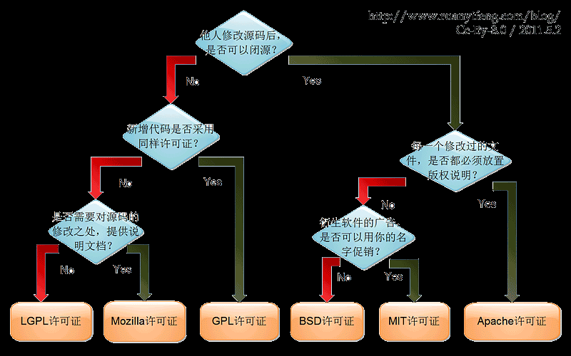
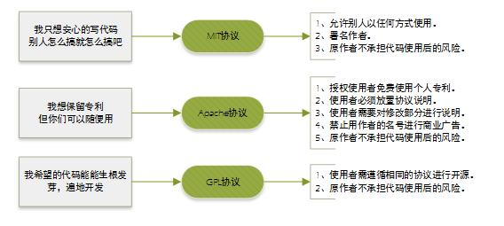

# Git | 学习笔记（待更新）


## 如何选择开源许可证？

世界上的开源许可证，大概有上百种。

很少有人搞得清楚它们的区别。

即使在最流行的六种协议 (GPL、BSD、MIT、Mozilla、Apache 和 LGPL) 之中做选择，也很复杂。

### 图解分析



> 左侧是 GPL 系，特点是其他人修改完源码后，也必须保持开源（衍生作品必须开源）。  
> 右侧则是比较宽松的开源协议，修改后的代码可以选择闭源，Apache 协议需要为每个修改后的文件都放置版权说明，MIT 与 BSD 协议则是最宽松的协议，只需要在项目中保留一份协议的副本，就可以几乎随意使用开源代码。  
> BSD 有个额外的限制，是不可以使用原作者的名字对项目进行促销推广。



## Git 分区概念

TODO

## 基本概念

## Commit 提交

- Commit：提交（每完成一次 Commit，Git 都保存一份仓库此时的状态的快照，所有文件的状态都被记录了下来，这样整个仓库都是可回溯的）
- Commit ID：提交 ID（就是提交的 SHA 值，使用哈希算法生成的一个独一无二的 ID）
- Commit Message：提交信息

### Branch 分支

- Branch：分支（存储库的不同版本）
- 每个仓库都有一个 main 分支或者 master 分支，也就是主干分支
- 创建分支也就是创建一个副本，是主干分支当时的状态快照
- 除了基于主干分支创建分支以外，还可以基于任意一个分支创建分支
- 在各自分支上的代码修改不会相互影响

### Merge 合并

- Merge：合并（把分支合并回主干分支）

### Pull Requet

- 简称 PR，意思是拉取请求、合并请求（将更改从一个分支合并到另外一个分支的提案）
- PR 会比较两个分支之间的代码差异，仓库的管理会来审核这个代码的改动，这个过程叫做 code review 也就是代码审计

### .git 文件夹

- .git 文件夹是 git 版本控制系统用来管理和存储项目历史的核心目录
- object 文件夹存储了所有的数据对象（文件、目录、commit）

| 对象名称 | 存储内容 | 对象特点                                                                                                        |
| -------- | -------- | --------------------------------------------------------------------------------------------------------------- |
| blob     | 文件     | 存储文件内容，每个文件以及文件历史版本都会存储并且压缩为一个 blob 对象，如果历史版本的内容相同则共用同一个 blob |
| tree     | 目录     | 存储了仓库的目录结构信息                                                                                        |
| commit   | 提交     | 一个 commit 对象包含了该提交的作者、提交时间、提交信息、还有对 tree 对象的引用                                  |

- refs 文件夹
  - heads 包含所有的本地分支，记录了每个分支最新一次 commit 的 ID
  - remote 包含有所有的远程分支
  - tags 包含所有的标签

- HEAD 文件记录了本地当前是哪个分支

## GitHub 基础操作

### Issues

TODO

### Repository

- Wiki
- Insights
- Project
- Discussion

### TODO

- ⬜ repository
- ⬜ README
- ⬜ license
- ⬜ .gitignore
- ⬜ Issues

## 命令

```bash
# 切换分支
git switch <BranchName>
```
