# MySQL | MySQL安装教程

## MySQL概述

- MySQL是一个关系型数据库管理系统，由瑞典MySQL AB公司开发，MySQL AB公司被Sun公司收购，Sun公司又被Oracle公司收购，目前属于Oracle公司。
- MySQL是目前最流行的关系型数据库管理系统，在WEB应用方面MySQL是最好的RDBMS应用软件之一。 国内淘宝网站就使用的是MySQL集群。
- MySQL特点
   - MySQL有开源版本和收费版本，你使用开源版本是不收费的。
   - MySQL支持大型数据库，可以处理上千万记录的大型数据库。
   - MySQL使用标准的SQL数据库语言形式。
   - MySQL在很多系统上面都支持。
   - MySQL对Java，C都有很好的支持，当然其他的语言也支持比如Python、PHP。
   - MySQL是可以定制的，采用了GPL协议，你可以修改源码来开发自己的MySQL系统。

## MySQL的下载

---

### 官网下载

> 第一步：打开`MySQL官网`[https://www.mysql.com/](https://www.mysql.com/)

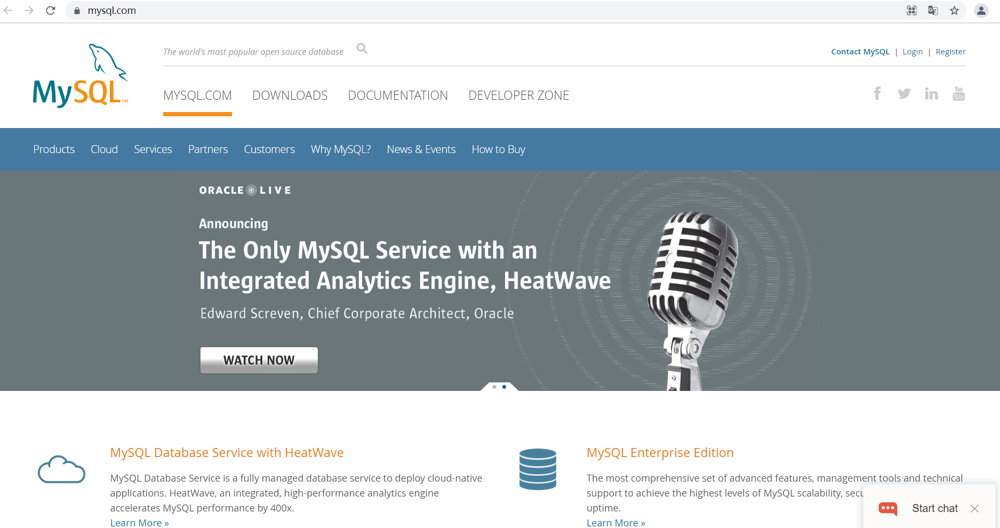

> 第二步：点击`"DOWNLOADS"`

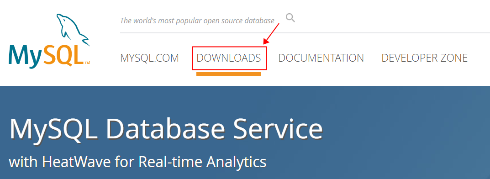

> 第三步：当前页继续下拉，直到找到下图链接

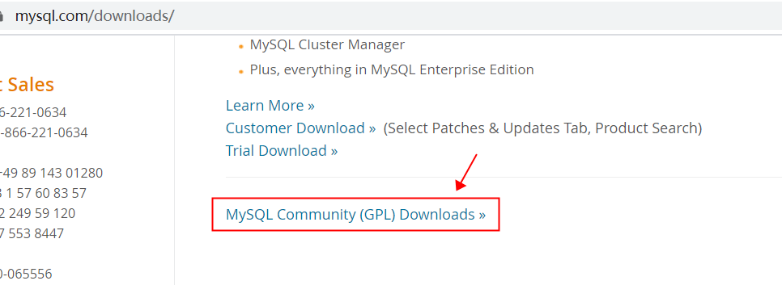

> 第四步：点击上图链接，进入下面页面，其中`“MySQL Community Server”`是解压版mysql，`“MySQL Installer for Windows”`是`安装版`，这里我们`选择解压版`

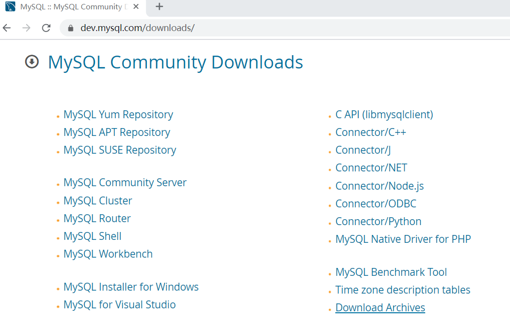

> 第五步：点击上图`“MySQL Community Server”`

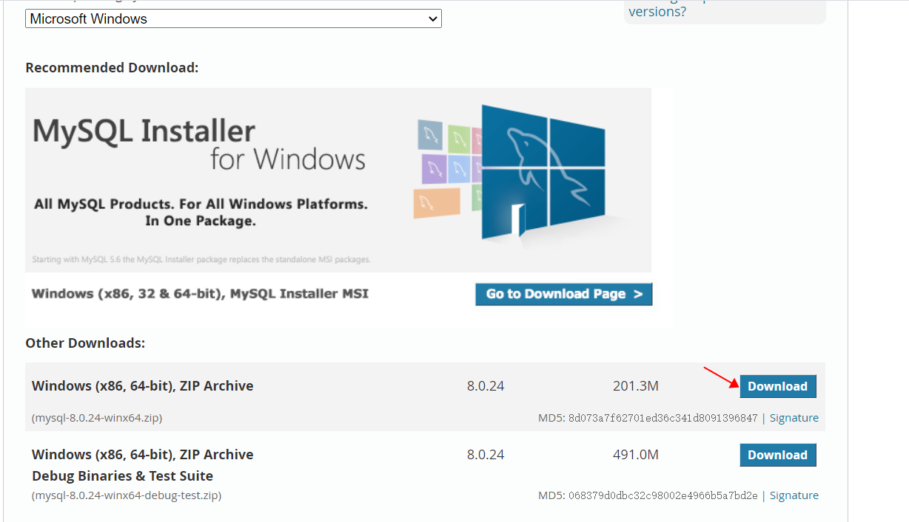

> 第六步：点击上图第1个“Download”

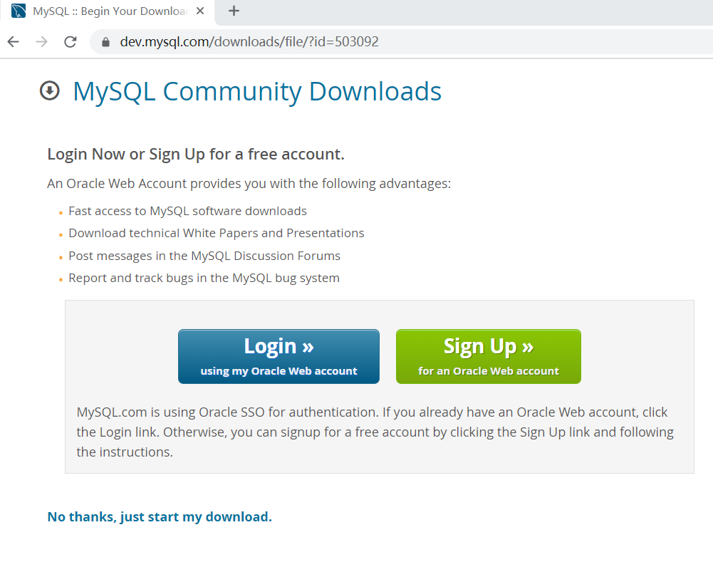

> 第七步：点击上图`“No thanks, just start my download.”`开始下载，直到下载完毕。

### 网盘下载

链接：[https://pan.baidu.com/s/1lRWC069K8GE-8rxr259ArQ?pwd=2009](https://pan.baidu.com/s/1lRWC069K8GE-8rxr259ArQ?pwd=2009) 提取码：2009

## MySQL安装与配置

---

> 将下载的zip压缩包解压，我这里直接解压到C盘的根目录下

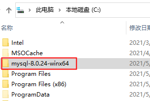

::: tip 提示
mysql的根目录为：C:\mysql-8.0.24-winx64
:::

> 将`C:\mysql-8.0.24-winx64\bin`目录配置到`环境变量path`当中

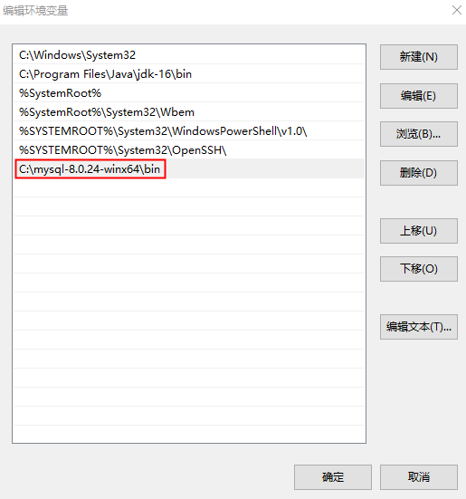

> 初始化`data目录`

::: danger 重点
使用管理员身份打开`dos命令窗口`（按win键，输入cmd，点击`管理员身份运行`）
:::

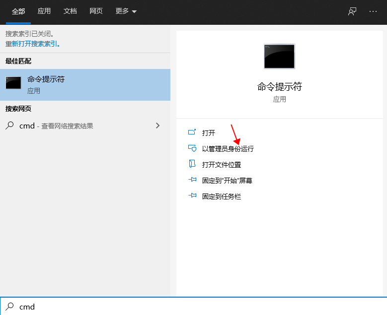

::: danger 重点
cd命令切换到`mysql的bin目录`下，执行`mysqld --initialize --console`进行data目录初始化，此时会在控制台生成一个`随机密码`，下图`红框中就是随机密码`
:::

::: info 技巧
左键选中密码，直接点击右键，此时密码已经复制到剪贴板中了，然后随便找一个文件，将密码粘贴到文件中保存起来。
:::

> 安装MySQL服务：cd命令切换到bin目录下，执行命令`mysqld -install`

> 查看mysql服务名称：`此电脑-右键-管理-服务和应用程序-服务-找MySQL服务`，如下图mysql服务名称：MySQL

> 启动MySQL服务：`net start mysql`，注意start后面是`mysql服务的名称`

> 停止mysql服务的命令：`net stop mysql`

::: warning 警告
启停mysql服务也可以在上一步的图中点击右键进行启停服务。
:::

> 登录mysql：输入`mysql -uroot -p`，然后回车，输入刚才的随机密码，然后回车，看到下图表示成功登录mysql

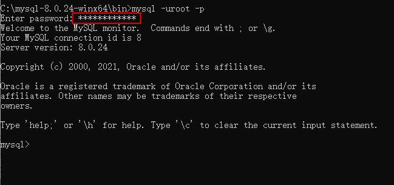

> 修改MySQL的root账户密码：`ALTER USER 'root'@'localhost' IDENTIFIED WITH mysql_native_password BY '新密码'`;

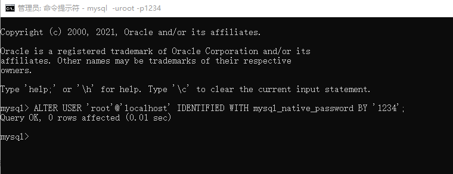

> 使用`新密码登录mysql`

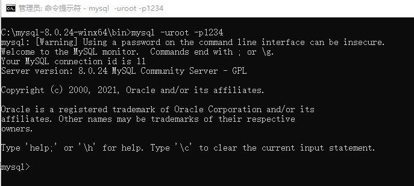

## MySQL卸载

---

> `停止mysql的服务`

> `删除mysql服务`

> `删除mysql的目录`

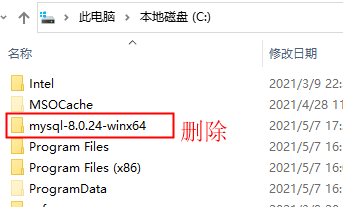

## 登录MySQL

---

### 本地登录

> 如果mysql的服务是启动的，打开dos命令窗口，输入：`mysql -uroot -p`，回车，然后输入`root账户的密码`

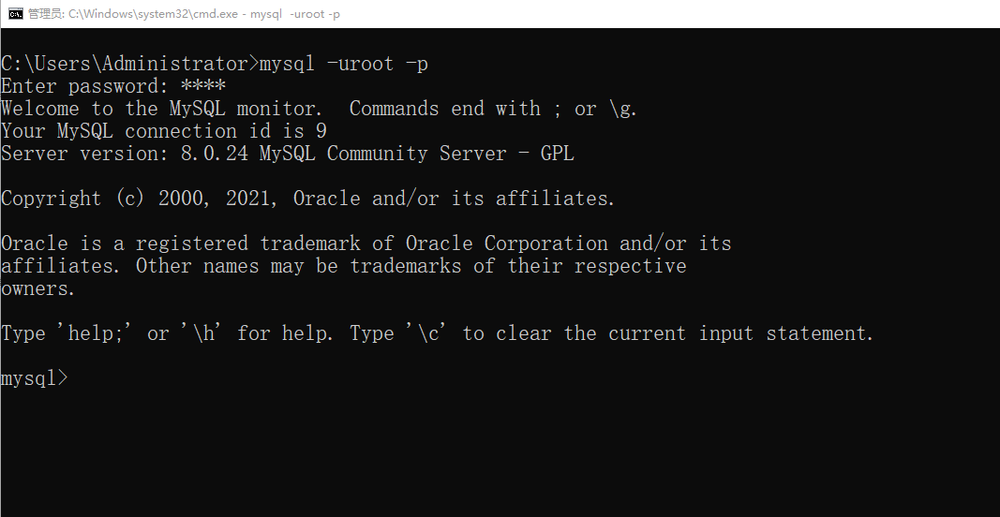

::: tip 解释`“mysql -uroot -p”`的含义

+ mysql是一个命令，`在bin目录下，对应的命令文件是mysql.exe`，如果将bin目录配置到环境变量path中，才可以在以上位置使用该命令。

+ -uroot 表示`登录的用户是root`，`u`实际上是`user单词的首字母`。

+ -p 表示`登录时使用密码`，`p`实际上是`password单词的首字母`。
:::

> 也可以将密码以`明文`的形式写到-p后面，这样做可能会`导致你的密码泄露`

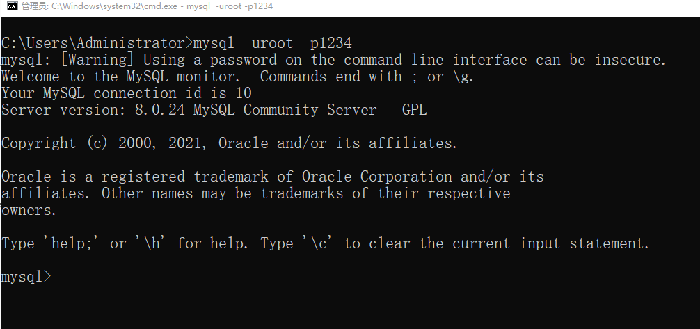

### 远程登录

> 假设mysql安装在A机器上，现在你要在B机器上连接mysql数据库，此时需要使用远程登录，远程登录时加上`远程机器的ip地址`即可

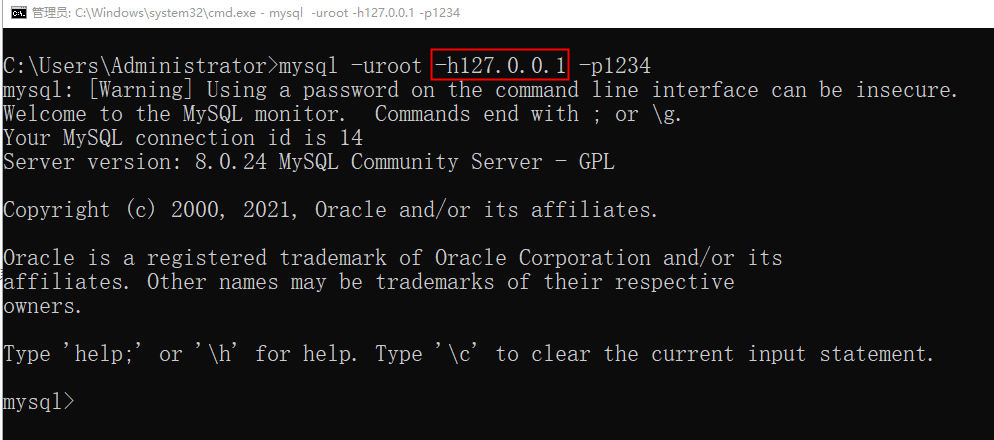

::: tip 解释`“mysql -uroot -h127.0.0.1 -p1234”`的含义
+ -h中的h实际上是host单词的首字母。

+ 在-h后面的是远程计算机的ip地址。

+ 127.0.0.1是计算机默认的本机IP地址。

+ 127.0.0.1又可以写作：localhost，他们是等效的。

+ -p后面的是root账户的密码。
:::

::: warning 警告
mysql默认情况下root账户是不支持远程登录的，其实这是一种安全策略，为了保护root账户的安全。如果希望root账户支持远程登录，这是需要进行设置的。
:::

> mysql8 开放`root账户远程登录权限`（危险动作）

::: warning 警告
+ 第一步：现在本地使用root账户登录mysql

+ 第二步：use mysql;

+ 第三步：update user set host = '%' where user = 'root';

+ 第四步：flush privileges;
:::