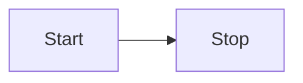
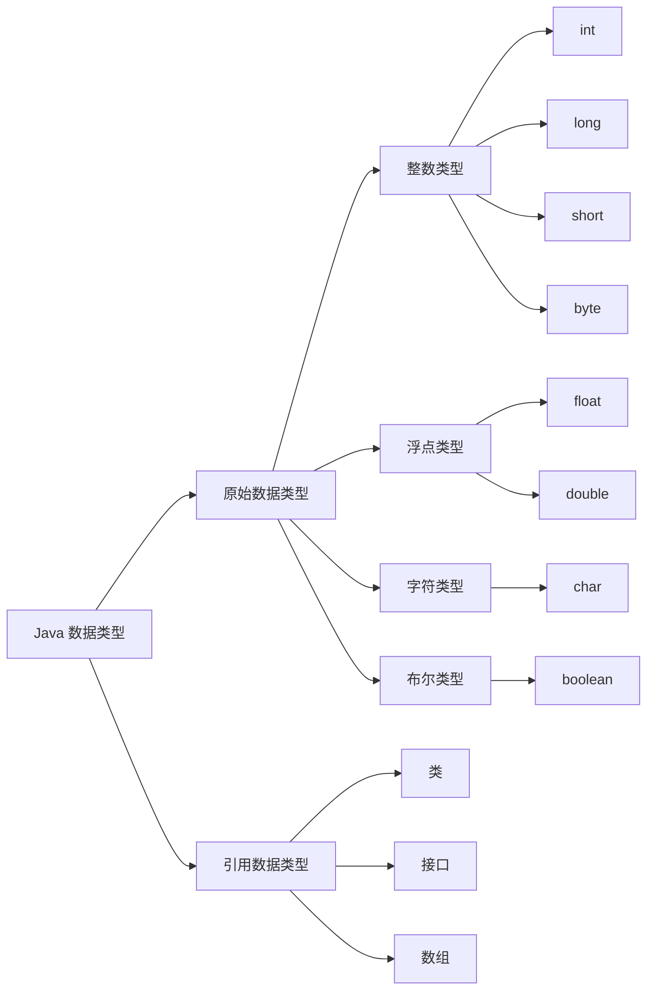
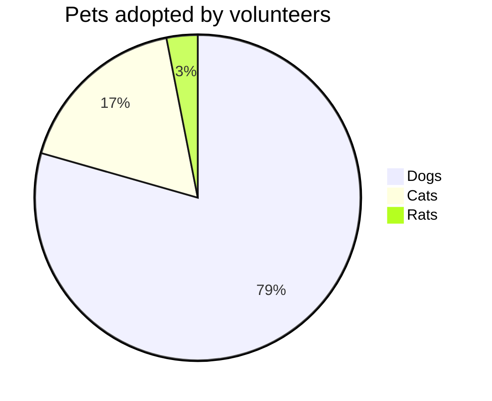

<!-- index.md -->
<xgplayer url="/科幻片.mp4" poster="/科幻片.png" />

GitHub链接图标：[GitHub](https://github.com/)

油管链接图标：[Youtube](https://www.youtube.com/)

B站链接图标：[哔哩哔哩](https://www.bilibili.com/)

CSDN链接图标：[CSDN](https://www.csdn.net/)

[点我跳转：基础功能](#基础功能)

* [vuejs.org](https://vuejs.org/)

* [GitHub 上的 VitePress](https://github.com/vuejs/vitepress)

<iframe 
style="width:100%; aspect-ratio:16/9; margin-top: 2em;" 
src="https://www.youtube.com/embed/bzyMLoSwYvk" 
frameborder="0" 
allow="accelerometer; autoplay; clipboard-write; encrypted-media; gyroscope; picture-in-picture; web-share" 
allowfullscreen>
</iframe>


<iframe 
style="width:100%; aspect-ratio:16/9; margin-top: 2em;" 
src="//player.bilibili.com/player.html?bvid=BV1YptMeMEcV" 
frameborder="0" 
allow="accelerometer; autoplay; clipboard-write; encrypted-media; gyroscope; picture-in-picture; web-share" 
allowfullscreen>
</iframe>

| Tables        |      Are      |  Cool |
| ------------- | :-----------: | ----: |
| col 3 is      | right-aligned | $1600 |
| col 2 is      |   centered    |   $12 |
| zebra stripes |   are neat    |    $1 |

* VitePress <Badge type="info" text="default" />
* VitePress <Badge type="tip" text="^1.9.0" />
* VitePress <Badge type="warning" text="beta" />
* VitePress <Badge type="danger" text="caution" />

```ts{2-3,5}
export default defineConfig({
  lang: 'zh-CN',
  title: "VitePress",
  description: "我的vitpress文档教程",
  titleTemplate: '另起标题覆盖title' ,
})
```

```ts{4}
export default defineConfig({
  lang: 'zh-CN',
  title: "VitePress",
  description: "我的vitpress文档教程", // [!code focus]
  titleTemplate: '另起标题覆盖title' ,
})
```

```ts{4-5}
export default defineConfig({
  lang: 'zh-CN', 
  title: "VitePress", 
  description: "我的vitpress文档教程", // [!code --]
  description: "更详细的vitpress中文文档教程", // [!code ++]
  titleTemplate: '另起标题覆盖title' ,
})
```

```ts{4-5}
export default defineConfig({
  lang: 'zh-CN', 
  title: "VitePress", 
  description: "我的vitpress文档教程", // [!code error]
  description: "更详细的vitpress中文文档教程", // [!code warning]
  titleTemplate: '另起标题覆盖title' ,
})
```

<Linkcard url="https://vitepress.yiov.top/" title="Vitepress中文搭建教程" description="https://vitepress.yiov.top/" logo="https://vitepress.yiov.top/logo.png"/>

<Linkcard url="https://yiov.top/computer/markdown.html" title="Markdown的简单用法" description="https://yiov.top/computer/markdown.html" logo="https://i.p-i.vip/47/20250105-6779fe143ce45.png"/>

```sh
#默认有行号
pnpm -v
```

```sh:no-line-numbers
#关闭行号
pnpm -v
```

::: code-group

```sh [pnpm]
#查询pnpm版本
pnpm -v
```

```sh [yarn]
#查询yarn版本
yarn -v
```

:::


::: code-group

```sh [npm]
npm install vitepress-plugin-group-icons
```

```sh [yarn]
yarn add vitepress-plugin-group-icons
```

```sh [pnpm]
pnpm add vitepress-plugin-group-icons
```

```sh [bun]
bun add vitepress-plugin-group-icons
```

:::


::: code-group
```sh [pnpm]
pnpm -v
```

```sh [yarn]
yarn -v
```

```sh [bun]
bun -v
```
:::

```c [HelloWorld.c]
#include <stdio.h>

int main(){

  printf("Hello World !!!");

  return 0;
}

```


<script setup>
import { VPTeamMembers } from 'vitepress/theme'

const members = [
  {
    avatar: 'https://www.github.com/yyx990803.png',
    name: 'Evan You',
    title: 'Creator',
    links: [
      { icon: 'github', link: 'https://github.com/yyx990803' },
      { icon: 'twitter', link: 'https://twitter.com/youyuxi' }
    ]
  },
  {
    avatar: 'https://www.github.com/kiaking.png',
    name: 'Kia King Ishii',
    title: 'Developer',
    links: [
      { icon: 'github', link: 'https://github.com/kiaking' },
      { icon: 'twitter', link: 'https://twitter.com/KiaKing85' }
    ]
  },
]
</script>

## Our Team

Say hello to our awesome team.

<VPTeamMembers size="medium" :members="members" />


<sapn class="marker-text">这里是重重点</sapn>


<sapn class="marker-text-highlight">这里是荧光笔</sapn>


<sapn class="marker-evy">这里是尤雨溪的主页样式，鼠标放在我上面看效果</sapn>


> 更新时间：2024年

> [!NOTE]
> 强调用户在快速浏览文档时也不应忽略的重要信息。

> [!TIP]
> 有助于用户更顺利达成目标的建议性信息。

> [!IMPORTANT]
> 对用户达成目标至关重要的信息。

> [!WARNING]
> 因为可能存在风险，所以需要用户立即关注的关键内容。

> [!CAUTION]
> 行为可能带来的负面影响。


::: timeline 2023-04-24
- 一个非常棒的开源项目 H5-Dooring 目前 star 3.1k
  - 开源地址 https://github.com/MrXujiang/h5-Dooring
  - 基本介绍 http://h5.dooring.cn/doc/zh/guide/
- 《深入浅出webpack》 http://webpack.wuhaolin.cn/
:::

::: timeline 2023-04-23
:::


::: info
This is an info box.
:::

::: tip
This is a tip.
:::

::: warning
This is a warning.
:::

::: danger
This is a dangerous warning.
:::

::: details
This is a details block.
:::

:::tabs
== tab a
a content
== tab b
b content
:::

:::tabs
== tab a
a content 2
== tab b
b content 2
:::

:::tabs key:ab
== tab a
a content
== tab b
b content
:::

:::tabs key:ab
== 选项卡 a
我是选项卡A的内容
== 选项卡 b
我是选项卡B的内容
:::











#### 后端技术栈

<p>
  &nbsp;
  &nbsp;
  &nbsp;
  &nbsp;
  &nbsp;
  &nbsp;
  &nbsp;
  &nbsp;
  &nbsp;
  &nbsp;
  &nbsp;
  &nbsp;
  &nbsp;
  &nbsp;
  &nbsp;
  &nbsp;
  &nbsp;
  &nbsp;
  &nbsp;
  &nbsp;
  &nbsp;
  &nbsp;
  &nbsp;
  &nbsp;
  &nbsp;
  &nbsp;
  &nbsp;
  &nbsp;
  &nbsp;
  &nbsp;
</p>

#### 前端技术栈

<p>
  &nbsp;
  &nbsp;
  &nbsp;
  &nbsp;
  &nbsp;
  &nbsp;
  &nbsp;
  &nbsp;
  &nbsp;
  &nbsp;
  &nbsp;
  &nbsp;
  &nbsp;
  &nbsp;
  &nbsp;
  &nbsp;
  &nbsp;
</p>

#### DevOps

<p>
  &nbsp;
  &nbsp;
  &nbsp;
  &nbsp;
  &nbsp;
  &nbsp;
  &nbsp;
  &nbsp;
  &nbsp;
  &nbsp;
  &nbsp;
  &nbsp;
</p>

#### 运维技术栈

<p>
  &nbsp;
  &nbsp;
  &nbsp;
  &nbsp;
  &nbsp;
  &nbsp;
  &nbsp;
</p>

#### 测试技术栈

<p>
  &nbsp;
  &nbsp;
</p>

#### 开发工具

<p>
  &nbsp;
  &nbsp;
  &nbsp;
  &nbsp;
  &nbsp;
  &nbsp;
</p>

#### 其他

<p>
  &nbsp;
  &nbsp;
  &nbsp;
  &nbsp;
</p>